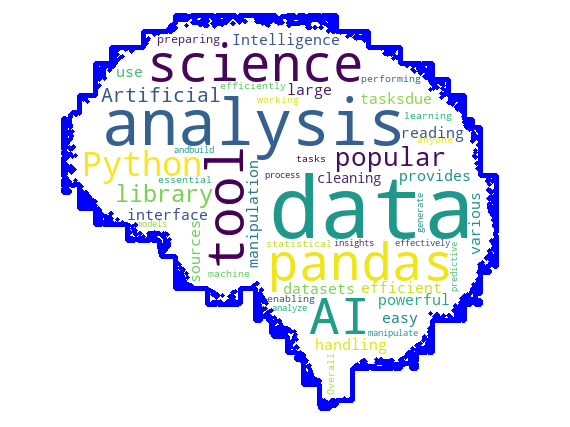
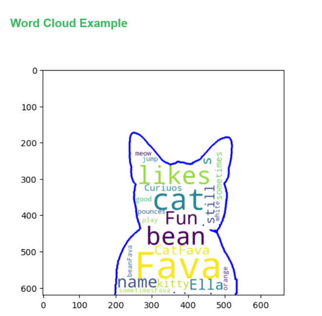
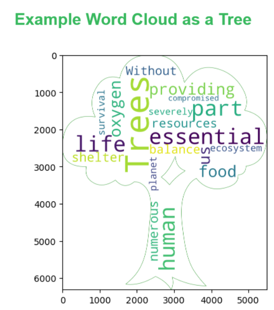

# Word Cloud - Produces a word cloud using the3 most relevant terminology using whatever cloud shape is supplied. 
**Word Cloud** A word cloud visually represents text data, with each word's size reflecting its frequency or importance in the corpus. It illuminates prominent and recurring terms, offering a snapshot of common words in a dataset. Word clouds assist in text analysis, sentiment analysis, and summarization, enabling data scientists to discern key themes and trends in large volumes of text data efficiently. 

**Word clouds** are commonly used by analysts, researchers, and marketers to quickly visualize and identify prevalent themes or keywords within large textual datasets, aiding in data interpretation and decision-making processes. They offer a concise and visually engaging summary of text content, making it easier for users to grasp the most significant aspects of the data at a glance.

## Getting Started
To get started with the **Word Cloud** solution repository, follow these steps:
1. Clone the repository to your local machine.
2. Install the required dependencies listed at the top of the notebook.
3. Explore the example code provided in the repository and experiment.
4. Run the notebook and make it your own - **EASY !**
    
## Solution Features
- Easy to understand and use  
- Easily Configurable 
- Quickly start your project with pre-built templates
- Its Fast and Automated

## Notebook Features

The goal of this solution is to **Jump Start** your development and have you up and running in 30 minutes. 

- **Self Documenting** - Automatically identifes major steps in notebook 
- **Self Testing** - Unit Testing for each function
- **Easily Configurable** - Easily modify with **config.INI** - keyname value pairs
- **Includes Talking Code** - The code explains itself 
- **Self Logging** - Enhanced python standard logging   
- **Self Debugging** - Enhanced python standard debugging
- **Low Code** - or - No Code  - Most solutions are under 50 lines of code
- **Educational** - Includes educational dialogue and background material
    
## List of Figures
             
    

## Github https://github.com/JoeEberle/ - Email  josepheberle@outlook.com 
    

    