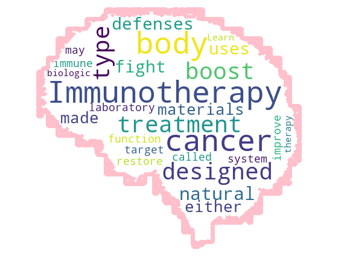

    
# Word Cloud 

## Produces a word cloud using the3 most relevant terminology using whatever cloud shape is supplied. 

    

    

**Word Cloud** A word cloud visually represents text data, with each word's size reflecting its frequency or importance in the corpus. It illuminates prominent and recurring terms, offering a snapshot of common words in a dataset. Word clouds assist in text analysis, sentiment analysis, and summarization, enabling data scientists to discern key themes and trends in large volumes of text data efficiently. 

**Word clouds** are commonly used by analysts, researchers, and marketers to quickly visualize and identify prevalent themes or keywords within large textual datasets, aiding in data interpretation and decision-making processes. They offer a concise and visually engaging summary of text content, making it easier for users to grasp the most significant aspects of the data at a glance.

    

    
## Getting Started

The goal of this solution is to **Jump Start** your development and have you up and running in 30 minutes. 

To get started with the **Word Cloud** solution repository, follow these steps:
1. Clone the repository to your local machine.
2. Install the required dependencies listed at the top of the notebook.
3. Explore the example code provided in the repository and experiment.
4. Run the notebook and make it your own - **EASY !**
    
## Solution Features

- Easy to understand and use  
- Easily Configurable 
- Quickly start your project with pre-built templates
- Its Fast and Automated
- Saves You Time 

## ⚙️ Key Features

- ✅ **Self Documenting** Automatically identifies and annotates major steps in a notebook, making the codebase readable and well structured.
- ✅ **Self Testing** Includes built in **unit tests** for each function to validate logic and ensure code reliability.
- ✅ **Easily Configurable** Uses a simple **config.ini** file for centralized settings and easy customization through key value pairs.
- ✅ **Talking Code** explains itself through inline commentary, helping you understand both **what** it does and **why** it does it.
- ✅ **Self Logging** extends Python’s standard **logging** module for **step by step runtime insights**.
- ✅ **Self Debugging** Includes debugging hooks and detailed error tracing to simplify development and troubleshooting.
- ✅ **Low Code or  No Code** Designed to minimize complexity — most full solutions are under 50 lines of code.
- ✅ **Educational** Each template includes educational narrative and background context to support learning, teaching, and collaborative development.

    
## List of Figures
             
    

## Github https://github.com/JoeEberle/ - Email  josepheberle@outlook.com 
    

    